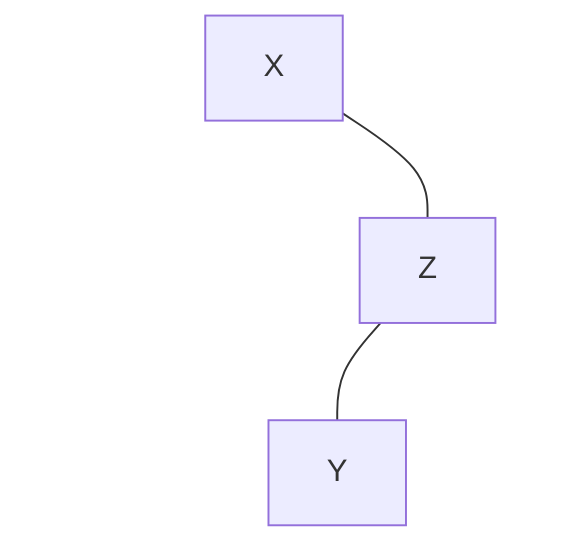
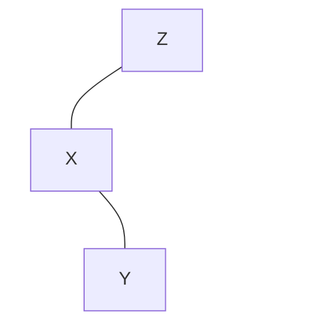

# 16-avl 平衡二叉树

## 练习 1. 不能恢复高度不变性的证明

第五节第二种情况：



以 X 为根节点，进行一次左旋：



## 练习 4. 插入左子树时逆反的出现和修复

1. 插入左子节点

    ```mermaid
    graph TB
    C---B
    C~~~D(( ))
    style D fill:#f100,stroke-width:0px
    B---A((A))
    B~~~X(( ))
    style X fill:#f100,stroke-width:0px
    ```

    需要进行一次以 C 为根节点的右旋：

    ```mermaid
    graph TB
    B---A((A))
    B---C
    ```

2. 插入右子节点

    ```mermaid
    graph TB
    C---A
    C~~~D(( ))
    style D fill:#f100,stroke-width:0px
    A~~~X(( ))
    A---B((B))
    style X fill:#f100,stroke-width:0px
    ```

    需要先进行一次以 A 为根节点的左旋：

    ```mermaid
    graph TB
    C---B((B))
    C~~~D(( ))
    style D fill:#f100,stroke-width:0px
    B---A
    B~~~X(( ))
    style X fill:#f100,stroke-width:0px
    ```

    再进行一次以 C 为根节点的右旋：

    ```mermaid
    graph TB
    B((B))---A
    B---C
    ```
